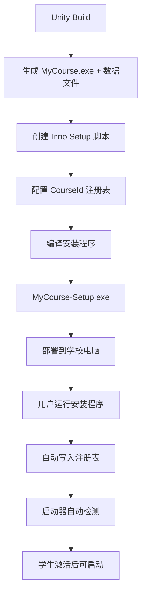

# Unity 打包 Windows 安装程序完整指南

## 概述

将Unity应用打包成专业的Windows安装程序，让启动器能自动检测到已安装的课程。

---

## 第一步：Unity Build 导出

### 1. 配置Build Settings

在Unity编辑器中：

1. **打开 Build Settings**
   ```
   File → Build Settings
   ```

2. **选择平台**
   - Platform: `Windows`
   - Architecture: `x86_64` (64位) 或 `x86` (32位)

3. **Player Settings 配置**
   
   点击 `Player Settings` 按钮，配置以下选项：

   **Company Name（公司名）:**
   ```
   YF
   ```

   **Product Name（产品名）:**
   ```
   Unity启动测试课程
   ```

   **Version（版本号）:**
   ```
   1.0.0
   ```

   **Icon（图标）:**
   - 设置应用程序图标（.ico文件）

   **Resolution and Presentation:**
   - Fullscreen Mode: `Windowed` 或 `Fullscreen`
   - Default Screen Width: `1920`
   - Default Screen Height: `1080`

4. **Build**
   
   - 点击 `Build` 按钮
   - 选择输出目录，例如：`D:\UnityBuilds\MyCourse\`
   - 等待Build完成

### 2. Build输出结构

Build完成后会生成：

```
D:\UnityBuilds\MyCourse\
├── MyCourse.exe              ← 主程序
├── MyCourse_Data\            ← 数据文件夹
│   ├── Managed\
│   ├── Resources\
│   ├── level0
│   ├── ...
├── UnityPlayer.dll
└── UnityCrashHandler64.exe
```

**⚠️ 重要：整个文件夹都需要打包！**

---

## 第二步：创建安装程序（Inno Setup）

### 1. 下载安装 Inno Setup

**官网下载：**
```
https://jrsoftware.org/isdl.php
```

下载并安装 `Inno Setup 6.x`

### 2. 创建安装脚本

新建文件 `MyCourse-Setup.iss`：

```iss
; Unity课程应用安装脚本
; 适用于YF课程启动器自动检测

#define MyAppName "Unity启动测试课程"
#define MyAppVersion "1.0.0"
#define MyAppPublisher "YF"
#define MyAppExeName "MyCourse.exe"

; ⚠️ 重要：这个CourseId必须与数据库中的课程ID完全一致！
#define CourseId "690af61251fc83dcf5a7d37d"

[Setup]
; 基本信息
AppId={{A1B2C3D4-1234-5678-9ABC-DEF012345678}
AppName={#MyAppName}
AppVersion={#MyAppVersion}
AppPublisher={#MyAppPublisher}
DefaultDirName={autopf}\YF Courses\{#MyAppName}
DefaultGroupName={#MyAppName}
DisableProgramGroupPage=yes

; 输出设置
OutputDir=D:\Installers
OutputBaseFilename=MyCourse-Setup-{#MyAppVersion}
Compression=lzma
SolidCompression=yes

; UI设置
WizardStyle=modern
SetupIconFile=D:\UnityBuilds\MyCourse\icon.ico
UninstallDisplayIcon={app}\{#MyAppExeName}

; 权限（需要管理员权限以写入HKLM注册表）
PrivilegesRequired=admin
PrivilegesRequiredOverridesAllowed=dialog

[Languages]
Name: "chinesesimplified"; MessagesFile: "compiler:Languages\ChineseSimplified.isl"

[Tasks]
Name: "desktopicon"; Description: "{cm:CreateDesktopIcon}"; GroupDescription: "{cm:AdditionalIcons}"; Flags: unchecked

[Files]
; ⚠️ 修改为你的Unity Build输出路径
Source: "D:\UnityBuilds\MyCourse\*"; DestDir: "{app}"; Flags: ignoreversion recursesubdirs createallsubdirs

[Icons]
; 开始菜单快捷方式
Name: "{group}\{#MyAppName}"; Filename: "{app}\{#MyAppExeName}"
Name: "{group}\{cm:UninstallProgram,{#MyAppName}}"; Filename: "{uninstallexe}"

; 桌面快捷方式（可选）
Name: "{autodesktop}\{#MyAppName}"; Filename: "{app}\{#MyAppExeName}"; Tasks: desktopicon

[Registry]
; 🔑 关键：写入注册表让启动器自动检测
; CourseId必须与数据库中的课程ID完全一致！
Root: HKLM; Subkey: "SOFTWARE\YFCourses\{#CourseId}"; ValueType: string; ValueName: "InstallPath"; ValueData: "{app}\{#MyAppExeName}"; Flags: uninsdeletekey
Root: HKLM; Subkey: "SOFTWARE\YFCourses\{#CourseId}"; ValueType: string; ValueName: "CourseName"; ValueData: "{#MyAppName}"; Flags: uninsdeletekey
Root: HKLM; Subkey: "SOFTWARE\YFCourses\{#CourseId}"; ValueType: string; ValueName: "Version"; ValueData: "{#MyAppVersion}"; Flags: uninsdeletekey

[Run]
; 安装完成后询问是否运行
Filename: "{app}\{#MyAppExeName}"; Description: "{cm:LaunchProgram,{#StringChange(MyAppName, '&', '&&')}}"; Flags: nowait postinstall skipifsilent
```

### 3. 关键配置说明

#### 必须修改的地方：

1. **CourseId（第9行）**
   ```iss
   #define CourseId "690af61251fc83dcf5a7d37d"
   ```
   ⚠️ **必须从管理后台获取正确的课程ID！**

2. **Unity Build路径（第37行）**
   ```iss
   Source: "D:\UnityBuilds\MyCourse\*"; DestDir: "{app}";
   ```
   修改为你的Unity Build输出路径。

3. **AppId（第13行）**
   ```iss
   AppId={{A1B2C3D4-1234-5678-9ABC-DEF012345678}
   ```
   使用工具生成唯一的GUID。在线工具：https://www.guidgenerator.com/

#### 注册表说明：

```iss
[Registry]
Root: HKLM; 
Subkey: "SOFTWARE\YFCourses\{#CourseId}"; 
ValueName: "InstallPath"; 
ValueData: "{app}\{#MyAppExeName}";
```

- `HKLM`: HKEY_LOCAL_MACHINE，系统级注册表
- `SOFTWARE\YFCourses`: 固定路径，启动器会扫描这里
- `{#CourseId}`: 课程ID（必须与数据库一致）
- `InstallPath`: 应用程序完整路径
- `CourseName`: 课程名称（显示用）

### 4. 编译安装程序

1. **打开 Inno Setup Compiler**

2. **加载脚本**
   ```
   File → Open → 选择 MyCourse-Setup.iss
   ```

3. **编译**
   ```
   Build → Compile (或按 Ctrl+F9)
   ```

4. **输出**
   
   编译完成后会在 `D:\Installers\` 生成：
   ```
   MyCourse-Setup-1.0.0.exe
   ```

---

## 第三步：测试安装程序

### 1. 运行安装程序

双击 `MyCourse-Setup-1.0.0.exe`

- 选择安装路径（默认：`C:\Program Files\YF Courses\Unity启动测试课程\`）
- 点击"安装"
- 安装完成

### 2. 验证注册表

**打开注册表编辑器：**
```
Win+R → 输入 regedit → 回车
```

**导航到：**
```
HKEY_LOCAL_MACHINE\SOFTWARE\YFCourses\690af61251fc83dcf5a7d37d
```

**应该看到：**
- `InstallPath` = `C:\Program Files\YF Courses\Unity启动测试课程\MyCourse.exe`
- `CourseName` = `Unity启动测试课程`
- `Version` = `1.0.0`

### 3. 测试启动器检测

1. 打开YF课程启动器
2. 按 `Ctrl+Shift+I` 打开开发者工具
3. 查看Console日志：

```
🔍 开始自动检测已安装课程...
📋 检查注册表...
  ✓ 注册表发现 1 门课程
```

4. 在课程列表中应该能看到这个课程
5. 激活后点击"启动课程"，应用会启动并收到Token

---

## 高级配置

### 添加自定义卸载前提示

```iss
[Code]
function InitializeUninstall(): Boolean;
begin
  Result := True;
  if MsgBox('确定要卸载 {#MyAppName} 吗？卸载后需要重新激活才能使用。', 
            mbConfirmation, MB_YESNO) = IDNO then
    Result := False;
end;
```

### 检查是否已安装

```iss
[Code]
function InitializeSetup(): Boolean;
var
  OldPath: String;
begin
  Result := True;
  
  // 检查是否已安装
  if RegQueryStringValue(HKLM, 'SOFTWARE\YFCourses\{#CourseId}', 
                          'InstallPath', OldPath) then
  begin
    if MsgBox('检测到已安装旧版本，是否继续安装（会覆盖旧版本）？', 
              mbConfirmation, MB_YESNO) = IDNO then
      Result := False;
  end;
end;
```

### 添加VC++ Redistributable依赖

如果Unity应用需要VC++ Runtime：

```iss
[Files]
Source: "vcredist_x64.exe"; DestDir: {tmp}; Flags: deleteafterinstall

[Run]
Filename: {tmp}\vcredist_x64.exe; Parameters: "/quiet /norestart"; \
  StatusMsg: "安装 Visual C++ 运行库..."; Flags: waituntilterminated
```

---

## Unity代码：接收Token

在Unity中创建脚本 `TokenReceiver.cs`：

```csharp
using UnityEngine;
using System;
using System.Text;

public class TokenReceiver : MonoBehaviour
{
    private string jwtToken;
    private UserInfo userInfo;

    void Start()
    {
        // 获取命令行参数
        string[] args = Environment.GetCommandLineArgs();
        
        // 查找 --token 参数
        foreach (string arg in args)
        {
            if (arg.StartsWith("--token="))
            {
                jwtToken = arg.Substring(8);
                Debug.Log("✅ 接收到Token: " + jwtToken.Substring(0, 20) + "...");
                
                // 解析JWT
                userInfo = ParseJWT(jwtToken);
                
                if (userInfo != null)
                {
                    Debug.Log($"用户信息:");
                    Debug.Log($"  ID: {userInfo.userId}");
                    Debug.Log($"  姓名: {userInfo.name}");
                    Debug.Log($"  角色: {userInfo.role}");
                    Debug.Log($"  手机: {userInfo.phone}");
                }
                
                return;
            }
        }
        
        // 如果没有Token，显示警告
        Debug.LogWarning("⚠️ 未找到Token！请通过启动器启动本应用。");
    }

    UserInfo ParseJWT(string token)
    {
        try
        {
            // JWT格式: header.payload.signature
            string[] parts = token.Split('.');
            if (parts.Length != 3) return null;
            
            // Base64 URL解码 payload部分
            string payload = parts[1];
            
            // 修正Base64填充
            int mod = payload.Length % 4;
            if (mod > 0) payload += new string('=', 4 - mod);
            
            // 替换URL安全字符
            payload = payload.Replace('-', '+').Replace('_', '/');
            
            // 解码
            byte[] jsonBytes = Convert.FromBase64String(payload);
            string json = Encoding.UTF8.GetString(jsonBytes);
            
            Debug.Log("JWT Payload: " + json);
            
            // 解析JSON（使用Unity的JsonUtility或第三方库）
            return JsonUtility.FromJson<UserInfo>(json);
        }
        catch (Exception e)
        {
            Debug.LogError("JWT解析失败: " + e.Message);
            return null;
        }
    }
}

[Serializable]
public class UserInfo
{
    public string userId;
    public string name;
    public string role;
    public string phone;
    public string school;
    public string className;
    
    // JWT标准字段
    public long iat;  // issued at
    public long exp;  // expiration
}
```

将此脚本挂载到场景中的任意GameObject上（建议创建一个 `GameManager`）。

---

## 常见问题

### Q1: 如何获取课程ID？

**A:** 在管理后台：
```
http://localhost:3001
→ 登录管理员账号
→ 课程管理
→ 查看课程列表，每个课程都有ID
```

### Q2: Inno Setup中文乱码？

**A:** 保存 `.iss` 文件时使用 **UTF-8 with BOM** 编码。

### Q3: 安装需要管理员权限吗？

**A:** 是的，因为需要写入 `HKLM` 注册表。如果不需要管理员权限，可以改用：
- 注册表：改用 `HKCU`（当前用户）
- 安装路径：改用 `{localappdata}\YF Courses\`

### Q4: 如何更新已安装的应用？

**A:** 
1. 增加版本号
2. 保持 `CourseId` 和 `AppId` 不变
3. 重新编译安装程序
4. 运行新的安装程序会覆盖旧版本

### Q5: Unity Build很大，安装包太大怎么办？

**A:** Inno Setup支持压缩：
```iss
Compression=lzma2/ultra64
SolidCompression=yes
```

---

## 完整工作流程总结



---

## 下一步

1. ✅ Unity Build导出
2. ✅ 创建Inno Setup脚本
3. ✅ 配置正确的CourseId
4. ✅ 编译测试
5. ✅ 部署到目标电脑
6. ✅ 启动器自动检测成功！

有任何问题随时问我！🚀

